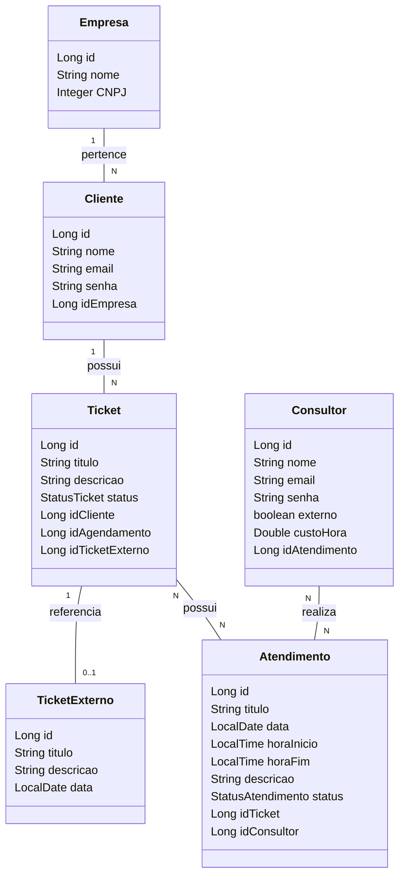

```mermaid
classDiagram
    class Atendimento {
        Long id
        String titulo
        LocalDate data
        LocalTime horaInicio
        LocalTime horaFim
        String descricao
        StatusAtendimento status
        Long idTicket
        Long idConsultor
    }

    class Ticket {
        Long id
        String titulo
        String descricao
        StatusTicket status
        Long idCliente
        Long idAgendamento
        Long idTicketExterno
    }

    class Consultor {
        Long id
        String nome
        String email
        String senha
        boolean externo
        Double custoHora
        Long idAtendimento
    }

    class Cliente {
        Long id
        String nome
        String email
        String senha
        Long idEmpresa
    }

    class Empresa {
        Long id
        String nome
        Integer CNPJ
    }

    class TicketExterno {
        Long id
        String titulo
        String descricao
        LocalDate data
    }

    Cliente "1" -- "N" Ticket : possui
    Empresa "1" -- "N" Cliente : pertence
    Ticket "1" -- "0..1" TicketExterno : referencia
    Ticket "N" -- "N" Atendimento : possui
    Consultor "N" -- "N" Atendimento : realiza
```
