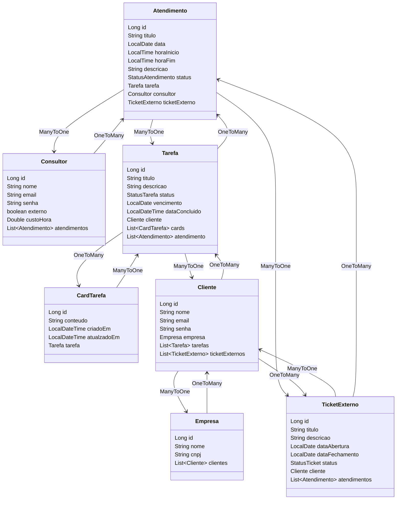

Este projeto foi idealizado para gerenciamento de atendimentos e tarefas, do meu dia a dia, onde controlo os tickets da empresa que trabalho e tarefas. 
O sistema permite:

- Cadastrar e gerenciar **atendimentos**, associando-os a consultores, tarefas e tickets externos.
- Organizar **tarefas** com status e anotações (cards), associadas a clientes e permitindo atualizações ao longo do tempo.
- **Clientes** são vinculados a **empresas** e podem gerar tickets externos que serão acompanhados por consultores.
- Consultores podem ser cadastrados e atribuídos a atendimentos.
- **Tickets externos** são registrados, podendo passar por um ciclo de abertura e fechamento, com atendimentos vinculados.

A aplicação facilita o acompanhamento e a gestão de interações entre clientes(Solicitantes) e consultores(Sendo eu sem custo ou externo, com custo), controlando tarefas e atendimentos de forma estruturada.

